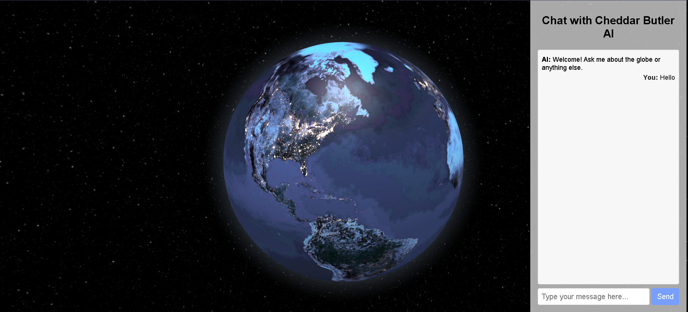

# Globe.gl Sample Collection

[Globe.gl](https://github.com/vasturiano/globe.gl) is a powerful tool that in addition to rendering earth globes, can also help visualize other concepts particularly of interest in fields like natural systems and physics.

Here are a few samples of simple HTML pages rendering visually appealing 3D animations.

Check back later as this page is updated.  

## Update 3.4.25 - OpenAI Map meets Google 🗺️🧠🌐

[Jarvis Globe](jarvisai/) is an attempt to fuse the Google Maps and OpenAI APIs with a 3D earth that can be explored.  

